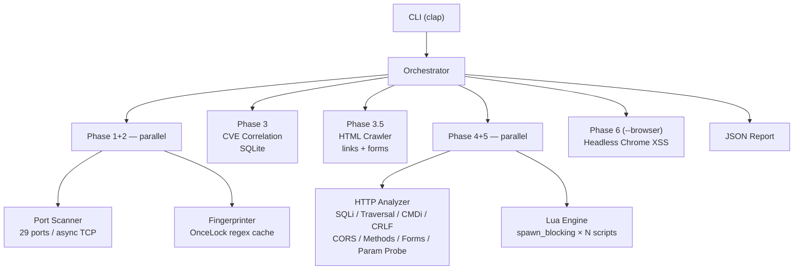

# 🛡️ Sentinel

> CERT-grade web vulnerability scanner written in Rust

[](https://github.com/typemnm/web-sentinel/actions/workflows/ci.yml)
[](LICENSE)
[](https://www.rust-lang.org)

```
sentinel --target https://example.com
```

```
[✓] Port Scan          — 29 common ports
[✓] Tech Fingerprint   — WordPress 6.4 / PHP 8.2 / Nginx 1.24
[✓] CVE Correlation    — 19 seeded CVEs, CVE-2024-34069 matched
[✓] Security Headers   — 6 headers checked (CSP, HSTS, Referrer-Policy...)
[✓] CORS               — Wildcard origin with credentials
[✓] SQLi Detection     — Error-based + time-based blind
[✓] Path Traversal     — ../../etc/passwd in ?file=
[✓] Command Injection  — ;echo marker reflected
[✓] CRLF Injection     — Header injection via %0d%0a
[✓] Cookie Analysis    — session missing HttpOnly
[✓] Open Redirect      — ?next= accepts external URL
[✓] 403 Bypass         — Headers + path mutations (11 techniques)
[✓] HTTP Methods       — TRACE / PUT enabled
[✓] Info Disclosure    — Server version, debug headers
[✓] Page Crawler      — 3 links, 1 form discovered
[✓] Form Injection    — SQLi in POST /login (field: username)
[✓] Param Probing     — ?id=' triggers SQL error
[✓] Lua Plugins (18)   — SSRF, SSTI, GraphQL, admin panels...
[✓] DOM XSS            — alert() confirmed via headless Chrome

Report → sentinel_report.json
```

---

## Why Sentinel

| | Nuclei | OWASP ZAP | Sentinel |
|---|---|---|---|
| Runtime | Go binary | JVM (500MB+) | **Rust — 14MB single binary** |
| XSS verification | Template match | Proxy-based | **Real JS execution (headless Chrome)** |
| Extensibility | YAML templates | Groovy scripts | **Lua — hot-reload, no recompile** |
| False positives | Medium | Low | **Low (alert() confirmed)** |
| CI/CD fit | ✅ | ❌ (GUI-heavy) | ✅ |

---

## Detection Coverage

| Category | What is checked | Severity |
|----------|-----------------|----------|
| **Tech Stack** | Web server, CMS, framework, language (14+ signatures) | Info |
| **CVE** | Version-matched CVE lookup — 19 pre-seeded CVEs (semver comparison) | High |
| **Open Ports** | 29 common ports (TCP async connect) | Info |
| **Security Headers** | X-Frame-Options, X-Content-Type-Options, HSTS (max-age), CSP, Referrer-Policy, Permissions-Policy | Low |
| **CORS** | Wildcard origin, origin reflection, credentials leak | Medium–High |
| **SQL Injection** | Error-based (14 signatures), time-based blind, per-parameter parallel | High |
| **Path Traversal** | `../../etc/passwd`, URL-encoded variants, 5 OS signatures | High |
| **Command Injection** | Echo-based + time-based, 4 shell metacharacter styles | Critical |
| **CRLF Injection** | Header injection via `%0d%0a` payloads | High |
| **Cookie Flags** | HttpOnly / Secure / SameSite attributes | Medium |
| **Open Redirect** | `redirect`, `url`, `next`, `return`, `goto` parameters | Medium |
| **403 Bypass** | 5 bypass headers + 6 path mutations, raced via `select_ok` | Medium |
| **HTTP Methods** | TRACE / PUT / DELETE detection via OPTIONS | Medium |
| **Info Disclosure** | Server version, X-Powered-By, debug headers (6 types) | Low |
| **Mixed Content** | HTTP resources loaded on HTTPS pages | Medium |
| **Page Crawler** | Auto-discover links + forms from HTML (scope-filtered) | — |
| **Common Param Probing** | Guess `id`, `q`, `file`, `path` etc. on param-less URLs | High |
| **Form Injection** | POST/GET form fields tested for SQLi + CMDi | High–Critical |
| **Body Pattern Analysis** | HTML comments, hidden inputs, internal IPs, error traces | Low–Medium |
| **DOM XSS** | `<script>`, ``, `<svg onload>` via headless Chrome | High |
| **Reflected XSS** | URL parameter injection, JS alert() verified | High |
| **Lua Plugins (18)** | SSRF, SSTI, GraphQL, admin panels, backup files, JS CVEs, and more | Varies |

---

## Quick Start

### Option A — Pre-built binary

```bash
# Linux (amd64)
curl -LO https://github.com/typemnm/web-sentinel/releases/latest/download/sentinel-linux-amd64.tar.gz
tar xzf sentinel-linux-amd64.tar.gz && sudo mv sentinel /usr/local/bin/

# macOS (Apple Silicon)
curl -LO https://github.com/typemnm/web-sentinel/releases/latest/download/sentinel-macos-arm64.tar.gz
tar xzf sentinel-macos-arm64.tar.gz && sudo mv sentinel /usr/local/bin/
```

### Option B — Docker

```bash
docker pull ghcr.io/typemnm/web-sentinel:latest

docker run --rm \
  -v "$(pwd)/output:/app/output" \
  -v "$(pwd)/scripts:/app/scripts" \
  ghcr.io/typemnm/web-sentinel:latest \
  --target https://example.com
```

### Option C — Build from source

```bash
git clone https://github.com/typemnm/web-sentinel
cd web-sentinel
make install      # builds release binary → /usr/local/bin/sentinel
```

Requires: Rust 1.75+, Chromium (for `--browser` only)

---

## Usage

```
sentinel --target <URL> [OPTIONS]

Options:
  -t, --target <URL>       Scan target
  -o, --output <FILE>      JSON report path  [default: sentinel_report.json]
      --threads <N>        Concurrency       [default: 50]
      --rps <N>            Requests/second   [default: 10]
      --browser            Enable headless Chrome XSS scan
      --no-ports           Skip port scan
      --scope <DOMAIN>     Restrict scope (supports *.domain)
      --timeout <SEC>      Request timeout   [default: 10]
  -s, --silent             Suppress info output
  -v, --verbose            Debug logs (-vv for trace)
```

### Common scenarios

```bash
# Fast HTTP-only check (no port scan)
sentinel --target https://target.com --no-ports --rps 30

# Full deep scan with browser XSS
sentinel --target http://internal-app.local --browser --rps 5 -vv

# Scoped scan (allow subdomains)
sentinel --target https://app.example.com --scope example.com

# CI/CD silent mode
sentinel --target $DEPLOY_URL --silent -o /tmp/report.json
```

---

## Lua Plugin System

Drop a `.lua` file into `scripts/` — it runs automatically on every scan.

```lua
-- scripts/admin_panel.lua
local resp = http.get(TARGET .. "/admin")

if resp.status == 200 then
    report.finding(
        "high",                               -- severity
        "custom",                             -- category
        "Exposed Admin Panel",                -- title
        "Admin page accessible without auth", -- description
        TARGET .. "/admin"                    -- url
    )
end
```

**Available APIs:**

| Function | Description |
|----------|-------------|
| `http.get(url)` | GET request → `{status, body, headers, url, elapsed_ms}` |
| `http.post(url, body)` | POST request (form-urlencoded) |
| `http.head(url)` | HEAD request (no body downloaded) |
| `http.get_with_headers(url, {k=v})` | GET with custom headers |
| `report.finding(sev, cat, title, desc, url)` | Report a vulnerability |
| `TARGET` | Global: current scan target URL |

**Sandbox**: `io`, `os`, `require`, `loadfile` are stripped — scripts cannot access the filesystem or execute system commands.

**18 built-in plugins**: SSRF, SSTI, GraphQL introspection, debug endpoints, WordPress config backup, robots.txt analysis, backup files, admin panels, source maps, CORS reflection, host header injection, .htaccess/.htpasswd, info disclosure, error page leak, JSONP callback, vulnerable JS libraries, .git exposure, .env exposure.

Plugins run in parallel (`spawn_blocking` threads), so adding more scripts has no sequential overhead.

---

## Architecture



All findings are collected as plain `Vec<Finding>` — no shared mutex across phases.

---

## CI/CD Integration

GitHub Actions workflows are included:

| Workflow | Trigger | Steps |
|----------|---------|-------|
| `ci.yml` | push / PR → `main` | fmt → clippy → test → release artifact |
| `release.yml` | `v*` tag push | Build Linux + macOS binaries → GitHub Release |

To publish a release:

```bash
git tag v0.2.0 && git push origin v0.2.0
```

### Fail pipeline on High/Critical findings

```bash
sentinel --target $URL --silent -o /tmp/sentinel.json

python3 -c "
import json, sys
r = json.load(open('/tmp/sentinel.json'))
hits = r['summary']['high'] + r['summary']['critical']
sys.exit(1) if hits > 0 else print('PASS')
"
```

---

## Development

```bash
make test     # run 31 unit tests
make check    # fmt + clippy + test
make build    # debug build
make release  # optimized release (lto + strip)
make docker   # build Docker image
```

---

## Contributing

Extend Sentinel's detection coverage with Lua scripts — no Rust knowledge required.

```lua
-- scripts/your_check.lua
local resp = http.get(TARGET .. "/secret-path")
if resp.status == 200 and resp.body:find("sensitive_signature") then
    report.finding("high", "custom", "Title", "Description", TARGET .. "/secret-path")
end
```

Drop a `.lua` file into `scripts/` and it runs automatically — no recompilation needed.

**Contribution workflow:**

```
Fork → Write scripts/your_check.lua → Test locally → Submit PR
```

**Scripts we'd love to have:**

| Script | Detection | Difficulty |
|--------|-----------|------------|
| `xml_xxe.lua` | XXE Injection | Medium |
| `firebase_misconfig.lua` | Firebase public DB | Easy |
| `api_key_leak.lua` | API key patterns in responses | Easy |
| `jwt_none_alg.lua` | JWT `alg: none` bypass | Medium |
| `prototype_pollution.lua` | `__proto__` parameter injection | Medium |

See **[CONTRIBUTING.md](CONTRIBUTING.md)** for the full guide, PR checklist, and API reference.

---

## Legal

> **This tool is intended exclusively for use against systems you own or have explicit written authorization to test.**
>
> Unauthorized scanning is illegal under the Computer Fraud and Abuse Act (CFAA), the EU Network and Information Security Directive, and equivalent legislation worldwide.
>
> The authors assume no liability for misuse. Use responsibly.

---

## License

MIT License - see LICENSE file for details

---

## Documentation

- [Overview](docs/overview.md) — Architecture, design principles, roadmap
- [User Guide](docs/user-guide.md) — Installation, CLI reference, Lua API, troubleshooting
- [Contributing](CONTRIBUTING.md) — Lua script contribution guide, PR checklist, wishlist
