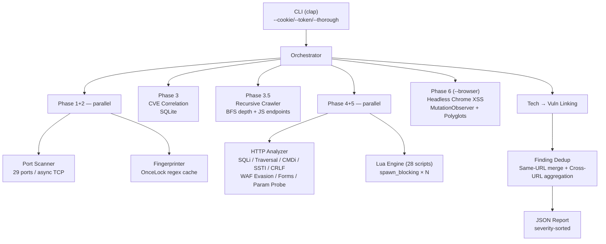

# 🛡️ Sentinel

> CERT-grade web vulnerability scanner written in Rust

[](https://github.com/typemnm/web-sentinel/actions/workflows/ci.yml)
[](LICENSE)
[](https://www.rust-lang.org)

```
sentinel --target https://example.com
```

```
[✓] Port Scan          — 29 common ports
[✓] Tech Fingerprint   — WordPress 6.4 / PHP 8.2 / Nginx 1.24
[✓] CVE Correlation    — 19 seeded CVEs, CVE-2024-34069 matched
[✓] Security Headers   — 6 headers checked (CSP, HSTS, Referrer-Policy...)
[✓] CORS               — Wildcard origin with credentials
[✓] SQLi Detection     — Error-based + time-based blind (baseline calibrated)
[✓] Path Traversal     — 16 payloads incl. double-encode, null-byte, UTF-8 overlong
[✓] Command Injection  — ;echo marker reflected + time-based
[✓] SSTI Detection     — 6 template engines (Jinja2, ERB, FreeMarker, Smarty, Mako, Thymeleaf)
[✓] CRLF Injection     — Header injection via %0d%0a
[✓] Cookie Analysis    — session missing HttpOnly
[✓] Open Redirect      — Location header inspection (no-follow)
[✓] 403 Bypass         — Headers + path mutations (11 techniques)
[✓] HTTP Methods       — TRACE / PUT enabled
[✓] Info Disclosure    — Server version, debug headers
[✓] Recursive Crawl   — BFS depth-3, 100 URLs + JS endpoint extraction
[✓] Form Injection    — SQLi + CMDi in POST/GET forms (parallel)
[✓] Param Probing     — ?id=' triggers SQL error + SSTI probing
[✓] WAF Evasion        — 9 strategies (fast/thorough mode)
[✓] Rate Limiter       — governor-backed RPS enforcement
[✓] Auth Support       — Cookie / Bearer / Basic / Custom header
[✓] Finding Dedup      — Same-URL merge + cross-URL low/info aggregation
[✓] Lua Plugins (28)   — SSRF, SSTI, JWT, NoSQL, XXE, IDOR, deserialization...
[✓] DOM XSS            — alert() + MutationObserver via headless Chrome

Report → sentinel_report.json (deduplicated, severity-sorted)
```

---

## Why Sentinel

| | Nuclei | OWASP ZAP | Sentinel |
|---|---|---|---|
| Runtime | Go binary | JVM (500MB+) | **Rust — 14MB single binary** |
| XSS verification | Template match | Proxy-based | **Real JS execution (headless Chrome)** |
| Extensibility | YAML templates | Groovy scripts | **Lua — hot-reload, no recompile** |
| False positives | Medium | Low | **Low (alert() confirmed)** |
| CI/CD fit | ✅ | ❌ (GUI-heavy) | ✅ |

---

## Detection Coverage

| Category | What is checked | Severity |
|----------|-----------------|----------|
| **Tech Stack** | Web server, CMS, framework, language (18+ signatures incl. Angular, React, Vue, Flask) | Info |
| **CVE** | Version-matched CVE lookup — 19 pre-seeded CVEs (semver comparison) | High |
| **Open Ports** | 29 common ports (TCP async connect) | Info |
| **Security Headers** | X-Frame-Options, X-Content-Type-Options, HSTS (max-age), CSP, Referrer-Policy, Permissions-Policy | Low |
| **CORS** | Wildcard origin, origin reflection, credentials leak | Medium–High |
| **SQL Injection** | Error-based (14 signatures), time-based blind with baseline calibration, WAF evasion variants | High |
| **Path Traversal** | 16 payloads: basic, recursive-strip, double-encode, null-byte, UTF-8 overlong, absolute, Windows | High |
| **Command Injection** | Echo-based + time-based (baseline-calibrated), 4 shell metacharacter styles | Critical |
| **SSTI** | 6 template engines: Jinja2/Twig, ERB, FreeMarker, Smarty, Mako, Thymeleaf — unique math expressions to prevent false positives | Critical |
| **CRLF Injection** | Header injection via `%0d%0a` payloads (case-insensitive header check) | High |
| **Cookie Flags** | HttpOnly / Secure / SameSite attributes | Medium |
| **Open Redirect** | Location header inspection (no-follow) on `redirect`, `url`, `next`, `return`, `goto` parameters | Medium |
| **403 Bypass** | 5 bypass headers + 6 path mutations, raced via `select_ok` | Medium |
| **HTTP Methods** | TRACE / PUT / DELETE detection via OPTIONS | Medium |
| **Info Disclosure** | Server version, X-Powered-By, debug headers (6 types) | Low |
| **Mixed Content** | HTTP resources loaded on HTTPS pages | Medium |
| **WAF Evasion** | 9 encoding strategies: double URL encode, unicode overlong, case mixing, inline comment, hex encode, char bypass, HTML entity, whitespace substitution. Fast (3) / Thorough (9) modes | — |
| **Recursive Crawler** | BFS with configurable depth/URL limits, JS endpoint extraction (fetch/axios/XHR), **SPA support** (`<script src>` JS file parsing for API path discovery) | — |
| **Common Param Probing** | Guess `id`, `q`, `file`, `path` etc. + SSTI params on param-less URLs | High–Critical |
| **Form Injection** | POST/GET form fields tested for SQLi + CMDi (parallelized with `join_all`) | High–Critical |
| **Body Pattern Analysis** | HTML comments, hidden inputs, internal IPs, error traces | Low–Medium |
| **DOM XSS** | `<script>`, ``, `<svg onload>` + MutationObserver + 8 polyglot payloads via headless Chrome | High |
| **Reflected XSS** | URL parameter injection, JS alert() verified | High |
| **Finding Dedup** | Same-URL merge (keep highest severity), cross-URL low/info aggregation, evidence truncation | — |
| **Rate Limiting** | Governor-backed per-second rate limiter enforcing `--rps` | — |
| **Authentication** | Cookie, Bearer token, Basic auth, custom header — applied to all requests | — |
| **Tech → Vuln Linking** | Fingerprint results enrich findings (e.g., "PHP detected — higher LFI likelihood") | — |
| **Lua Plugins (28)** | SSRF, SSTI, JWT, NoSQL injection, XXE, IDOR, deserialization, file upload bypass, prototype pollution, and more. **SPA-aware**: backup/htaccess checks filter false positives from SPA shells | Varies |

---

## Quick Start

### Option A — Pre-built binary

```bash
# Linux (amd64)
curl -LO https://github.com/typemnm/web-sentinel/releases/latest/download/sentinel-linux-amd64.tar.gz
tar xzf sentinel-linux-amd64.tar.gz && sudo mv sentinel /usr/local/bin/

# macOS (Apple Silicon)
curl -LO https://github.com/typemnm/web-sentinel/releases/latest/download/sentinel-macos-arm64.tar.gz
tar xzf sentinel-macos-arm64.tar.gz && sudo mv sentinel /usr/local/bin/
```

### Option B — Docker

```bash
docker pull ghcr.io/typemnm/web-sentinel:latest

docker run --rm \
  -v "$(pwd)/output:/app/output" \
  -v "$(pwd)/scripts:/app/scripts" \
  ghcr.io/typemnm/web-sentinel:latest \
  --target https://example.com
```

### Option C — Build from source

```bash
git clone https://github.com/typemnm/web-sentinel
cd web-sentinel
make install      # builds release binary → /usr/local/bin/sentinel
```

Requires: Rust 1.75+, Chromium (for `--browser` only)

---

## Usage

```
sentinel --target <URL> [OPTIONS]

Options:
  -t, --target <URL>         Scan target
  -o, --output <FILE>        JSON report path        [default: sentinel_report.json]
      --threads <N>          Concurrency             [default: 50]
      --rps <N>              Requests/second          [default: 10]
      --browser              Enable headless Chrome XSS scan
      --no-ports             Skip port scan
      --scope <DOMAIN>       Restrict scope (supports *.domain)
      --timeout <SEC>        Request timeout          [default: 10]
      --thorough             Thorough mode: 9 WAF evasion variants (slower, deeper)
      --crawl-depth <N>      Max recursive crawl depth [default: 3]
      --crawl-max-urls <N>   Max URLs to visit         [default: 100]
      --cookie <COOKIE>      Auth cookie (e.g. "session=abc123")
      --token <TOKEN>        Bearer token for Authorization header
      --basic-auth <U:P>     Basic auth credentials ("user:pass")
      --auth-header <H:V>    Custom auth header ("X-API-Key:value")
  -s, --silent               Suppress info output
  -v, --verbose              Debug logs (-vv for trace)
```

### Common scenarios

```bash
# Fast HTTP-only check (no port scan)
sentinel --target https://target.com --no-ports --rps 30

# Full deep scan with browser XSS + thorough WAF evasion
sentinel --target http://internal-app.local --browser --thorough --rps 5 -vv

# Scoped scan (allow subdomains)
sentinel --target https://app.example.com --scope example.com

# Authenticated scan behind login
sentinel --target https://app.example.com --cookie "session=abc123; csrf=xyz"

# CI/CD silent mode
sentinel --target $DEPLOY_URL --silent -o /tmp/report.json

# Deep crawl with custom limits
sentinel --target https://target.com --crawl-depth 5 --crawl-max-urls 500
```

---

## Lua Plugin System

Drop a `.lua` file into `scripts/` — it runs automatically on every scan.

```lua
-- scripts/admin_panel.lua
local resp = http.get(TARGET .. "/admin")

if resp.status == 200 then
    report.finding(
        "high",                               -- severity
        "custom",                             -- category
        "Exposed Admin Panel",                -- title
        "Admin page accessible without auth", -- description
        TARGET .. "/admin"                    -- url
    )
end
```

**Available APIs:**

| Function | Description |
|----------|-------------|
| `http.get(url)` | GET request → `{status, body, headers, url, elapsed_ms}` |
| `http.post(url, body)` | POST request (form-urlencoded) |
| `http.post_json(url, body)` | POST request (application/json) |
| `http.head(url)` | HEAD request (no body downloaded) |
| `http.get_with_headers(url, {k=v})` | GET with custom headers |
| `report.finding(sev, cat, title, desc, url)` | Report a vulnerability |
| `TARGET` | Global: current scan target URL |

**Sandbox**: `io`, `os`, `require`, `loadfile` are stripped — scripts cannot access the filesystem or execute system commands.

**28 built-in plugins**: SSRF (15+ IP bypass encodings, cloud metadata), SSTI (10+ engines, WAF bypass), JWT vulnerabilities, NoSQL injection, XXE injection, IDOR detection, deserialization, file upload bypass, prototype pollution, JSON API injection, GraphQL introspection, debug endpoints, WordPress config backup, robots.txt analysis, backup files, admin panels, source maps, CORS reflection, host header injection, .htaccess/.htpasswd, info disclosure, error page leak, JSONP callback, vulnerable JS libraries, .git exposure, .env exposure.

Plugins run in parallel (`spawn_blocking` threads), so adding more scripts has no sequential overhead. All requests from Lua scripts are rate-limited and authenticated (inheriting `--cookie`/`--token` etc.).

---

## Architecture



All findings are collected as plain `Vec<Finding>` — no shared mutex across phases. Governor rate limiter enforces `--rps` on every HTTP request.

---

## CI/CD Integration

GitHub Actions workflows are included:

| Workflow | Trigger | Steps |
|----------|---------|-------|
| `ci.yml` | push / PR → `main` | fmt → clippy → test → release artifact |
| `release.yml` | `v*` tag push | Build Linux + macOS binaries → GitHub Release |

To publish a release:

```bash
git tag v0.2.0 && git push origin v0.2.0
```

### Fail pipeline on High/Critical findings

```bash
sentinel --target $URL --silent -o /tmp/sentinel.json

python3 -c "
import json, sys
r = json.load(open('/tmp/sentinel.json'))
hits = r['summary']['high'] + r['summary']['critical']
sys.exit(1) if hits > 0 else print('PASS')
"
```

---

## Development

```bash
make test     # run 48 unit tests
make check    # fmt + clippy + test
make build    # debug build
make release  # optimized release (lto + strip)
make docker   # build Docker image
```

---

## Contributing

Extend Sentinel's detection coverage with Lua scripts — no Rust knowledge required.

```lua
-- scripts/your_check.lua
local resp = http.get(TARGET .. "/secret-path")
if resp.status == 200 and resp.body:find("sensitive_signature") then
    report.finding("high", "custom", "Title", "Description", TARGET .. "/secret-path")
end
```

Drop a `.lua` file into `scripts/` and it runs automatically — no recompilation needed.

**Contribution workflow:**

```
Fork → Write scripts/your_check.lua → Test locally → Submit PR
```

**Scripts we'd love to have:**

| Script | Detection | Difficulty |
|--------|-----------|------------|
| `firebase_misconfig.lua` | Firebase public DB | Easy |
| `api_key_leak.lua` | API key patterns in responses | Easy |
| `s3_bucket_enum.lua` | S3 bucket public access | Easy |
| `websocket_check.lua` | WebSocket unauthenticated access | Medium |
| `cache_poisoning.lua` | Web cache poisoning | Hard |
| `subdomain_takeover.lua` | CNAME dangling detection | Hard |

> **Already included**: JWT (`jwt_vulnerabilities.lua`), XXE (`xxe_injection.lua`), prototype pollution (`prototype_pollution.lua`), NoSQL injection, IDOR, deserialization, file upload bypass, and more.

See **[CONTRIBUTING.md](CONTRIBUTING.md)** for the full guide, PR checklist, and API reference.

---

## Legal

> **This tool is intended exclusively for use against systems you own or have explicit written authorization to test.**
>
> Unauthorized scanning is illegal under the Computer Fraud and Abuse Act (CFAA), the EU Network and Information Security Directive, and equivalent legislation worldwide.
>
> The authors assume no liability for misuse. Use responsibly.

---

## License

MIT License - see LICENSE file for details

---

## Documentation

- [Overview](docs/overview.md) — Architecture, design principles, roadmap
- [User Guide](docs/user-guide.md) — Installation, CLI reference, Lua API, troubleshooting
- [Performance & Accuracy](docs/performance-improvements.md) — 19 optimization items (18 implemented)
- [Scan Results: Juice Shop](docs/scan-results-juiceshop.md) — OWASP Juice Shop scan report (v0.1.1)
- [Contributing](CONTRIBUTING.md) — Lua script contribution guide, PR checklist, wishlist
